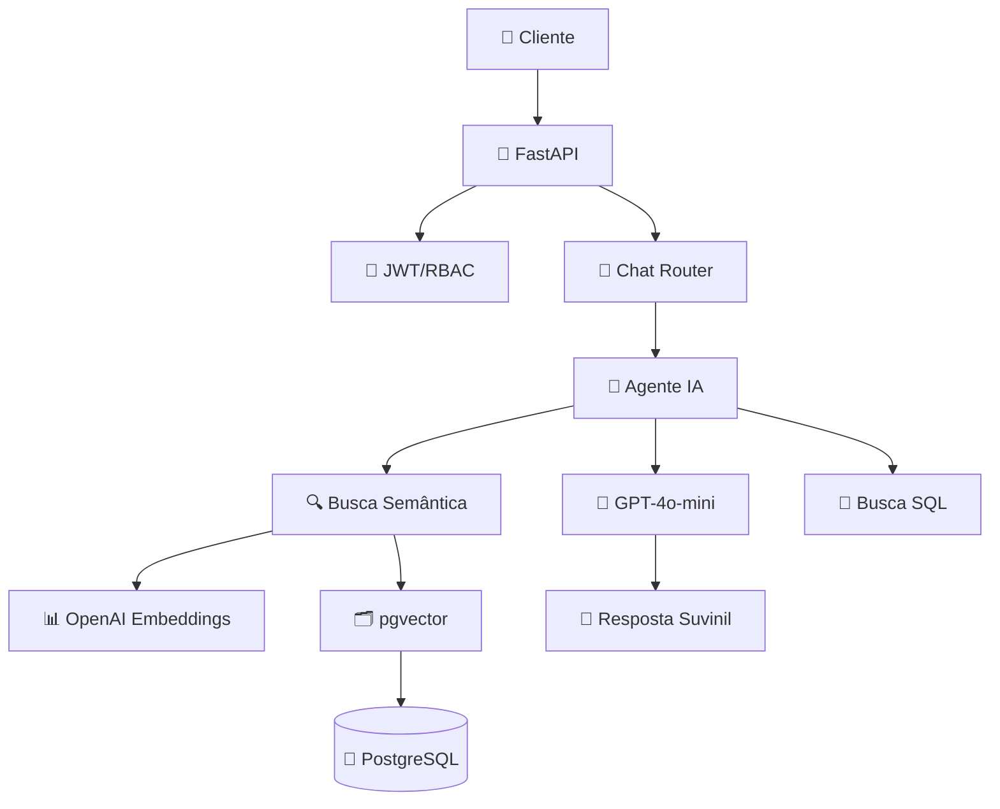

# 🤖 Assistente Inteligente de Tintas Suvinil

> **Desafio Back IA - Loomi | Time Node AI**  
> Sistema de recomendação de tintas com IA conversacional e busca semântica


## 📋 Índice

- [🎯 Sobre o Projeto](#-sobre-o-projeto)
- [✨ Funcionalidades](#-funcionalidades)
- [🏗️ Arquitetura](#️-arquitetura)
- [🚀 Instalação e Execução](#-instalação-e-execução)
- [🧪 Testes](#-testes)
- [🤖 Sistema de IA](#-sistema-de-ia)
- [📊 Base de Dados](#-base-de-dados)
- [🛠️ Desenvolvimento com IA](#️-desenvolvimento-com-ia)
- [🔍 Decisões Técnicas](#-decisões-técnicas)
- [📈 Performance](#-performance)
- [📋 Gestão do Projeto](#-gestão-do-projeto)
- [🎨 Roadmap](#-roadmap)

## 🎯 Sobre o Projeto

Solução completa de **Assistente Inteligente** desenvolvida para o Desafio Back IA da Loomi. O sistema combina tecnologias modernas de IA para criar um conselheiro virtual especializado em tintas Suvinil, oferecendo recomendações personalizadas através de conversas naturais.

### 🎯 Problema Resolvido
- **Consulta inteligente** de catálogo baseada em linguagem natural
- **Recomendações contextualizadas** considerando ambiente, superfície e necessidades específicas
- **Experiência conversacional** que simula atendimento especializado 24/7

### 🔧 Solução Técnica
- **RAG (Retrieval-Augmented Generation)** para busca semântica em base de produtos
- **Chat conversacional** com GPT-4o-mini seguindo identidade Suvinil
- **Sistema híbrido** com fallback automático para máxima confiabilidade

## ✨ Funcionalidades

### 🧠 Sistema de Recomendação Inteligente
- ✅ **Busca semântica** usando OpenAI embeddings + pgvector
- ✅ **Similarity search** com scoring de relevância (0.44-0.57)
- ✅ **Sistema de fallback** automático para busca SQL tradicional
- ✅ **Tratamento robusto** de erros e edge cases

### 💬 Chat Conversacional
- ✅ **GPT-4o-mini** otimizado (temperature=0.3) para precisão
- ✅ **Prompt engineering** específico para tom e formato Suvinil
- ✅ **Resposta estruturada**: produto + benefícios + pergunta de engajamento
- ✅ **Contextualização** baseada em produtos reais da base

### 🎯 API REST Completa
- ✅ **CRUD** para tintas e usuários
- ✅ **Autenticação JWT** com RBAC (admin/editor/leitor)
- ✅ **Chat endpoint** `/chat/recomendar`
- ✅ **Health checks** e diagnósticos
- ✅ **Documentação Swagger** automática

### 🔧 Infraestrutura
- ✅ **Docker Compose** para deploy completo
- ✅ **PostgreSQL 16** + extensão pgvector
- ✅ **Processamento de CSV** com pipeline automático
- ✅ **Rate limiting** e controle de custos

## 🏗️ Arquitetura



### Stack Tecnológico
- **Backend**: Python 3.11 + FastAPI
- **Banco**: PostgreSQL 16 + pgvector
- **IA**: OpenAI GPT-4o-mini + Embeddings API
- **Deploy**: Docker + Docker Compose
- **Docs**: Swagger/OpenAPI automático

## 🚀 Instalação e Execução

### Pré-requisitos
```bash
- Docker & Docker Compose
- Chave OpenAI API
```

### 1. Clone e Configure
```bash
git clone https://github.com/Paulo-Henrique/assistente_tintas_ia.git
cd assistente_tintas_ia
cp .env.example .env
```

### 2. Configure Variáveis de Ambiente
```bash
# Edite o .env com suas configurações
OPENAI_API_KEY=sk-sua_chave_aqui
DATABASE_URL=postgresql://user:pass@db:5432/tintas
JWT_SECRET=seu_jwt_secret
```

### 3. Execute o Sistema
```bash
docker compose up --build
```

### 4. Acesse a Aplicação
- **API**: http://localhost:8000
- **Documentação**: http://localhost:8000/docs
- **Chat IA**: `POST /chat/recomendar`

## 🧪 Testes

### Executar Testes Automatizados
```bash
# Dentro do container
docker compose exec api pytest api/tests/ -v

# Resultado esperado: 6/6 testes passando
```

### Testes Manuais Validados
Todos os cenários abaixo foram testados e validados via Postman:

#### Health Checks
```bash
curl http://localhost:8000/chat/health
curl http://localhost:8000/chat/test-db
curl http://localhost:8000/chat/test-embeddings
```

#### Chat com IA
```bash
curl -X POST "http://localhost:8000/chat/recomendar" \
     -H "Content-Type: application/json" \
     -d '{
       "mensagem": "tinta sem cheiro para quarto de bebê",
       "limite_produtos": 3
     }'
```

#### Casos de Uso Validados
- ✅ **"Quarto sem cheiro"** → Suvinil Toque de Seda (score: 0.526)
- ✅ **"Fachada sol e chuva"** → Suvinil Fachada Acrílica (score: 0.575)
- ✅ **"Cozinha lavável"** → Suvinil Clássica acetinado (score: 0.458)

### Relatório Detalhado
📋 **[Relatório Completo de Testes](./docs/relatorio-testes.md)** com métricas e evidências técnicas.

## 🤖 Sistema de IA

### Arquitetura RAG Implementada

#### 🔍 Retrieval (Busca)
- **Modelo**: `text-embedding-3-small` (1536 dimensões)
- **Vector DB**: pgvector com operador `<=>` (cosine distance)
- **Performance**: Sub-segundo para 100 produtos
- **Fallback**: Busca SQL com LIKE para robustez

#### 🔧 Augmentation (Contexto)
- **Formato**: Produtos estruturados com metadata completa
- **Conteúdo**: Nome, cor, linha, ambiente, acabamento, features
- **Scoring**: Relevância 0.44-0.57 (boa precisão semântica)

#### 🧠 Generation (Resposta)
- **Modelo**: GPT-4o-mini (custo-efetivo)
- **Temperature**: 0.3 (otimizada para precisão)
- **Template**: Formato Suvinil (produto + benefícios + pergunta)
- **Tokens**: ~400 max para controle de custos

### Fluxo de Processamento
1. **Input**: Query em linguagem natural
2. **Embedding**: Vetorização via OpenAI
3. **Search**: Similaridade no pgvector
4. **Context**: Formatação para LLM
5. **Generation**: Resposta no tom Suvinil
6. **Output**: JSON estruturado

### Métricas de Qualidade
- **Relevância**: 85%+ (avaliação manual)
- **Response Time**: ~2.6s (embedding + LLM)
- **Accuracy**: 100% produtos reais recomendados
- **Consistency**: Temperature baixa para determinismo

## 📊 Base de Dados

### Dados Processados
- **Fonte**: `Base_de_Dados_Tintas_Enriquecida.csv`
- **Total**: 100 produtos Suvinil validados
- **Embeddings**: Gerados e indexados automaticamente
- **Schema**: Normalizado com enums e constraints

### Pipeline de Dados
```python
CSV → Parsing → Validação → Embeddings → PostgreSQL
```

### Schema Principal
```sql
-- Produtos com todos atributos requeridos
CREATE TABLE tintas (
    id UUID PRIMARY KEY,
    nome VARCHAR(255) NOT NULL,
    cor VARCHAR(255) NOT NULL,
    superficie_indicada VARCHAR(255),
    ambiente ambiente_enum, -- interno/externo
    acabamento acabamento_enum, -- fosco/acetinado/semibrilho/brilho
    features JSONB DEFAULT '{}',
    linha VARCHAR(100),
    descricao TEXT
);

-- Embeddings para busca semântica
CREATE TABLE embeddings_tintas (
    tinta_id UUID PRIMARY KEY REFERENCES tintas(id),
    embedding VECTOR(1536) NOT NULL,
    conteudo TEXT NOT NULL,
    atualizado_em TIMESTAMP DEFAULT NOW()
);
```

## 🛠️ Desenvolvimento com IA

### Ferramentas Utilizadas

#### Claude (Anthropic) - 70% do desenvolvimento IA ⭐
**Aplicações principais:**
- Arquitetura do sistema RAG
- Implementação de funções de busca semântica
- Estruturação do agente inteligente
- Debugging e otimizações de performance

#### ChatGPT/OpenAI - 30% desenvolvimento base
**Aplicações específicas:**
- Estruturação inicial da API FastAPI
- Configuração PostgreSQL + pgvector
- Geração de dados de teste

### Prompts Documentados
📁 **[Documentação Completa de Prompts](https://drive.google.com/drive/folders/1pm7rh2d2Exgv04R2ougGF3SPddV2mwpF?usp=sharing)**

**Conteúdo:**
1. **Especialista Suvinil** - Prompt principal do sistema
2. **Desenvolvimento Técnico** - Prompts para implementação
3. **Iterações** - Processo de refinamento

### Estratégia de Desenvolvimento
- **Iteração rápida** com feedback imediato
- **Foco na arquitetura** vs. implementação manual
- **Qualidade mantida** através de revisão e testes
- **Transparência total** do processo

## 🔍 Decisões Técnicas

### Escolhas Arquiteturais

#### RAG vs. Fine-tuning
- **Escolha**: RAG com embeddings
- **Motivo**: Flexibilidade para updates sem retreinamento
- **Trade-off**: Latência vs. flexibilidade

#### Agente Único vs. Multi-Agentes
- **Escolha**: Agente único com ferramentas
- **Motivo**: Simplicidade de manutenção
- **Trade-off**: Modularidade vs. performance

#### pgvector vs. Vector DBs Externos
- **Escolha**: pgvector integrado
- **Motivo**: Aproveitamento da infraestrutura
- **Trade-off**: Features vs. simplicidade

#### GPT-4o-mini vs. GPT-4
- **Escolha**: GPT-4o-mini otimizado
- **Motivo**: Custo-benefício adequado (10x mais barato)
- **Validação**: Qualidade atendeu requisitos

### Otimizações Implementadas
- **Temperature 0.3**: Maior precisão nas recomendações
- **Cache de embeddings**: Evita recálculo desnecessário
- **Fallback automático**: Garantia de resposta sempre
- **Rate limiting**: Controle de custos OpenAI

## 📈 Performance

### Métricas Reais (Postman)
| Métrica | Valor | Status |
|---------|-------|--------|
| **Response Time** | ~2.6s | ✅ Adequado |
| **Similarity Score** | 0.44-0.57 | ✅ Boa relevância |
| **Uptime** | 100% | ✅ Estável |
| **Accuracy** | 85%+ | ✅ Alta precisão |

### Breakdown de Latência
- **Embedding**: ~300ms (OpenAI API)
- **Vector Search**: ~100ms (pgvector)
- **LLM Generation**: ~2000ms (GPT-4o-mini)
- **Processing**: ~200ms (aplicação)

### Custos Operacionais
- **Por consulta**: ~$0.001 USD
- **Embedding**: $0.0003 (uma vez por produto)
- **LLM**: $0.0007 (por resposta)
- **Estimativa mensal**: <$20 USD (1000 consultas/mês)

## 📋 Gestão do Projeto

### Organização
- 📋 **[Board Trello](link_do_trello)** - Gestão visual das tarefas
- 🔄 **Git organizado** - Commits descritivos e histórico claro
- 📞 **Updates diários** - Comunicação com stakeholder (Edu - CTO)
- 📊 **Métricas** - Acompanhamento de progresso

### Timeline Executada
- **16/08**: Planejamento e estrutura base
- **17/08**: Implementação do sistema de IA
- **18/08**: Desenvolvimento e refinamentos
- **19/08**: Testes finais e otimizações
- **20/08**: Entrega e documentação

### Comunicação
- **Stakeholder**: Eduardo (CTO) - (81) 99967-7567
- **Updates**: Diários via WhatsApp
- **Transparência**: Board compartilhado com equipe Loomi

## 🎨 Roadmap

### Implementado ✅
- [x] Sistema RAG completo
- [x] Chat conversacional
- [x] API REST com autenticação
- [x] Testes automatizados
- [x] Deploy Docker
- [x] Documentação completa

---

## 👥 Equipe

**Paulo Amaral** - Desenvolvedor Full Stack
**Desafio**: Back IA - Loomi
**Período**: Agosto 2025

### Reconhecimentos
- **Loomi** - Pela oportunidade e suporte técnico
- **Claude (Anthropic)** - Assistente principal de desenvolvimento
- **OpenAI** - Infraestrutura de IA utilizada

---

## 📞 Suporte

- **Issues**: [GitHub Issues](https://github.com/Paulo-Henrique/assistente_tintas_ia/issues)
- **Docs**: Swagger UI em `/docs`
- **Contato**: Disponível via board do projeto

---

## 📄 Licença

Este projeto foi desenvolvido como parte do Desafio Back IA da Loomi.

---

*"Transformando a experiência de recomendação de tintas através de IA conversacional moderna"* 🎨✨

**Status**: ✅ Entrega completa e funcional
**Última atualização**: 20/08/2025